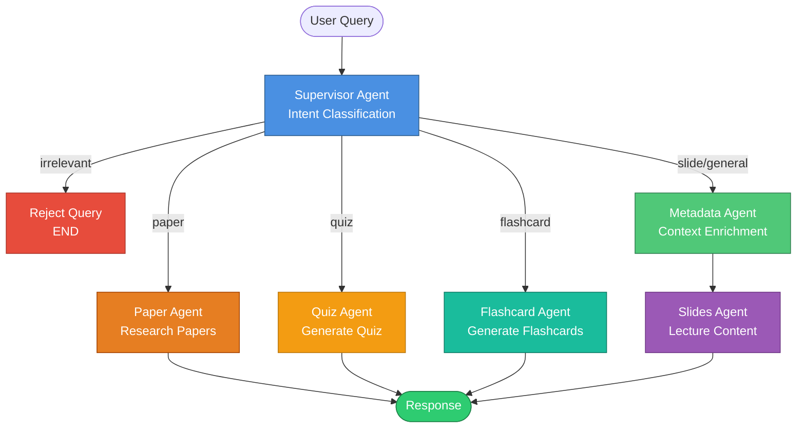

# Multi-Agent System Architecture

This directory contains the implementation of specialized agents that work together to handle different types of queries and tasks.

## Agent Workflow

The system uses a **LangGraph workflow** with conditional routing between agents:



## Agent Descriptions

### 1. Supervisor Agent

**File**: `supervisor_agent.py`

**Purpose**: Entry point for all queries. Classifies intent and routes to appropriate specialized agent.

**Responsibilities**:
- Analyze user query to determine intent
- Classify as: `paper`, `slide`, `quiz`, `flashcard`, `general`, or `irrelevant`
- Detect and reject irrelevant queries (not about lecture content)
- Determine which Pinecone namespaces to search
- Route to appropriate agent

**Key Features**:
- Few-shot learning examples for better classification
- Relevance detection to filter off-topic queries
- JSON-structured output for routing decisions

**Example Routing**:
```python
Query: "What is attention mechanism?"
→ Intent: general
→ Route: Metadata Agent → Slides Agent

Query: "Explain the Transformer paper"
→ Intent: paper
→ Route: Paper Agent

Query: "Generate a quiz on BERT"
→ Intent: quiz
→ Route: Quiz Agent

Query: "What's the weather today?"
→ Intent: irrelevant
→ Route: END (rejected)
```

### 2. Metadata Agent

**File**: `metadata_agent.py`

**Purpose**: Enriches queries with temporal context from lecture transcripts.

**Responsibilities**:
- Check if query is about "what professor is currently teaching"
- Load transcript context around current timestamp
- Enrich query with relevant transcript segments
- Pass enriched query to Slides Agent

**Key Features**:
- Loads previous 2 + current transcript segments
- Only enriches queries about current teaching
- Passes through other queries unchanged

**Example**:
```python
Query: "What is being discussed?"
Timestamp: 120.5 seconds
→ Loads transcript from 90-150 seconds
→ Enriched: "The professor is discussing attention mechanisms..."
→ Routes to Slides Agent
```

### 3. Slides Agent

**File**: `slides_agent.py`

**Purpose**: Answers questions about lecture slides and content.

**Responsibilities**:
- Retrieve relevant slides from Pinecone (`slides` namespace)
- Generate answers referencing specific slides
- Include slide numbers and titles in response
- Handle both specific and general slide queries

**Key Features**:
- Multi-namespace search (slides + transcript)
- Slide number and title citations
- Formatted responses with references

**Example Output**:
```
According to Slide 15 "Attention Mechanism":
The attention mechanism allows the model to focus on...

Referenced Slides:
- Slide 15: Attention Mechanism
- Slide 16: Multi-Head Attention
```

### 4. Paper Agent

**File**: `paper_agent.py`

**Purpose**: Answers questions about research papers.

**Responsibilities**:
- Retrieve relevant paper sections from Pinecone (`papers` namespace)
- Generate answers with proper citations
- Include paper titles, authors, and page numbers
- Handle technical paper-specific queries

**Key Features**:
- Academic citation format
- Page number references
- Author attribution

**Example Output**:
```
According to "Attention Is All You Need" (Vaswani et al.):
The Transformer architecture uses self-attention...

Citations:
- Vaswani et al., "Attention Is All You Need", Page 3
```

### 5. Quiz Agent

**File**: `quiz_agent.py`

**Purpose**: Generates multiple-choice quizzes from lecture content.

**Responsibilities**:
- Retrieve comprehensive slide content
- Generate exam-appropriate questions
- Create plausible distractors
- Provide explanations for correct answers

**Key Features**:
- Multiple difficulty levels
- Topic-based organization
- Detailed explanations
- JSON-structured output

**Example Output**:
```json
{
  "question": "What is the main advantage of self-attention?",
  "options": {
    "A": "Reduces model size",
    "B": "Captures long-range dependencies",
    "C": "Increases training speed",
    "D": "Reduces memory usage"
  },
  "correct_answer": "B",
  "explanation": "Self-attention allows the model to...",
  "difficulty": "medium",
  "topic": "Attention Mechanisms"
}
```

### 6. Flashcard Agent

**File**: `flashcard_agent.py`

**Purpose**: Creates study flashcards from lecture content.

**Responsibilities**:
- Extract key concepts from slides
- Generate question-answer pairs
- Focus on important definitions and concepts
- Create comprehensive coverage of topics

**Key Features**:
- Concise front/back format
- Concept-focused questions
- Comprehensive topic coverage

**Example Output**:
```json
{
  "front": "What is self-attention?",
  "back": "A mechanism that allows each position in a sequence to attend to all positions in the previous layer"
}
```

## Sample Q&A Scenarios

### Scenario 1: Lecture Content Query

**Q**: "What is instruction tuning and how does it improve LLMs?"

**Workflow**:
1. **Supervisor**: Classifies as `general` intent
2. **Metadata**: Checks if about current teaching → No
3. **Slides**: Retrieves slides on instruction tuning
4. **Response**: Detailed answer with slide references

**Sample Response**:
```
According to Slide 12 "Instruction Tuning":
Instruction tuning is a technique to fine-tune language models on 
instruction-following datasets. It improves LLMs by:
1. Better task generalization
2. Improved zero-shot performance
3. More aligned with user intent

Referenced Slides:
- Slide 12: Instruction Tuning
- Slide 13: FLAN and T0 Models
```

### Scenario 2: Research Paper Query

**Q**: "Explain the Chinchilla scaling law"

**Workflow**:
1. **Supervisor**: Classifies as `paper` intent
2. **Paper Agent**: Retrieves from Chinchilla paper
3. **Response**: Answer with academic citations

**Sample Response**:
```
According to "Training Compute-Optimal Large Language Models" 
(Hoffmann et al., 2022):

The Chinchilla scaling law shows that for compute-optimal training,
model size and training data should be scaled equally...

Citations:
- Hoffmann et al., "Training Compute-Optimal Large Language Models", Page 2
```

### Scenario 3: Quiz Generation

**Q**: "Generate a quiz with 5 questions about transformers"

**Workflow**:
1. **Supervisor**: Classifies as `quiz` intent
2. **Quiz Agent**: Retrieves transformer content, generates questions
3. **Response**: JSON array of quiz questions

### Scenario 4: Temporal Context Query

**Q**: "What is the professor talking about?" (at timestamp 120s)

**Workflow**:
1. **Supervisor**: Classifies as `general` intent
2. **Metadata**: Detects query about current teaching
3. **Metadata**: Loads transcript context (90-150s)
4. **Metadata**: Enriches query with transcript content
5. **Slides**: Retrieves relevant slides
6. **Response**: Answer based on current lecture segment

### Scenario 5: Irrelevant Query

**Q**: "What's the weather today?"

**Workflow**:
1. **Supervisor**: Classifies as `irrelevant`
2. **END**: Rejects query with message

**Response**:
```
I can't help with that. I'm designed to answer questions about 
lecture content, slides, and research papers related to this course. 
Please ask a question about the lecture material.
```

## Agent State

All agents share a common state defined in `state.py`:

```python
class AgentState(TypedDict):
    current_query: str              # Original user query
    enriched_query: str             # Query enriched with context
    timestamp: Optional[float]      # Video timestamp
    lecture_id: Optional[str]       # Lecture identifier
    intent: str                     # Classified intent
    target_namespaces: List[str]    # Pinecone namespaces to search
    response: str                   # Generated response
    citations: List[Dict]           # Source citations
    metadata: Dict                  # Additional metadata
    agent_history: List[str]        # Agents called in workflow
    next_agent: Optional[str]       # Next agent to call
```

## Configuration

Agent prompts are defined in `../config/prompts.yaml`. Each agent has:
- System prompt defining behavior
- Few-shot examples (for Supervisor)
- Output format specifications

## Performance Metrics

Based on RAGAS evaluation (see `../evaluation/README.md`):

| Metric | Score | Interpretation |
|--------|-------|----------------|
| **Answer Relevancy** | 0.93 | Excellent - Answers directly address questions |
| **Faithfulness** | 1.00 | Perfect - No hallucinations |
| **Context Recall** | 1.00 | Perfect - All ground truth retrieved |
| **Context Precision** | 0.86 | Very Good - Relevant contexts ranked highly |

## Adding New Agents

1. **Create agent file**: `new_agent.py`
2. **Implement node function**:
   ```python
   def new_agent_node(state: AgentState) -> Dict:
       # Agent logic here
       return {
           "response": "...",
           "agent_history": ["new_agent"],
           "metadata": {...}
       }
   ```
3. **Add to workflow**: Edit `../graph/workflow.py`
4. **Update routing**: Modify `route_after_supervisor()`
5. **Add prompts**: Update `../config/prompts.yaml`

## Troubleshooting

### Agent not being called
- Check intent classification in Supervisor logs
- Verify routing logic in `workflow.py`
- Review few-shot examples in `prompts.yaml`

### Poor quality responses
- Review agent prompts in `prompts.yaml`
- Check retrieved contexts in Pinecone
- Verify embedding model matches indexing

### Context not enriched
- Ensure transcript data is indexed
- Check timestamp is provided in query
- Verify Metadata Agent logic

## References

- [LangGraph Documentation](https://python.langchain.com/docs/langgraph)
- [LangChain Agents](https://python.langchain.com/docs/modules/agents/)
- [RAGAS Evaluation](../evaluation/README.md)
